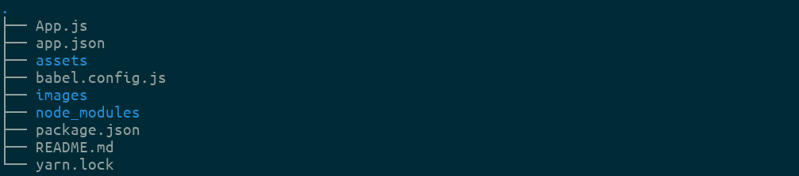
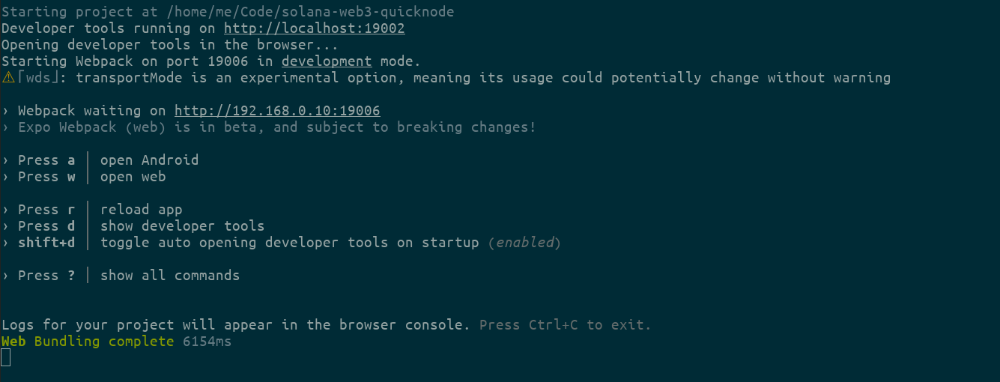
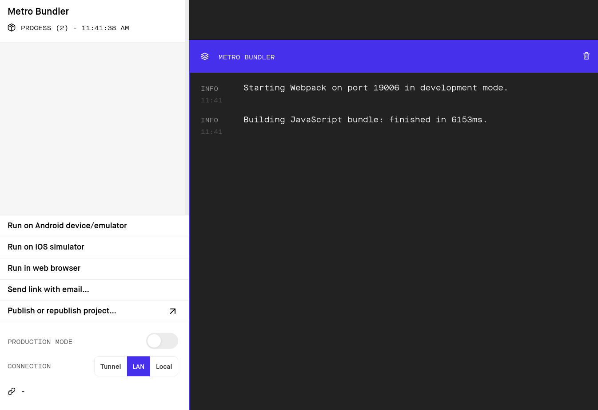
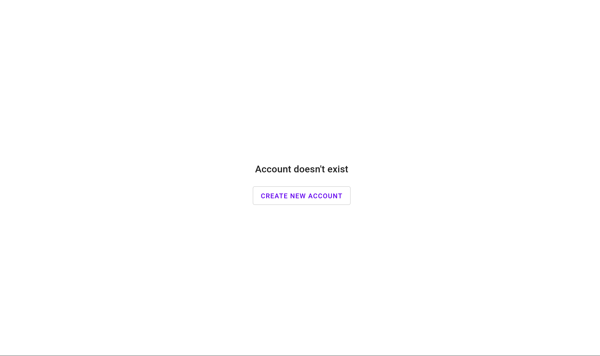
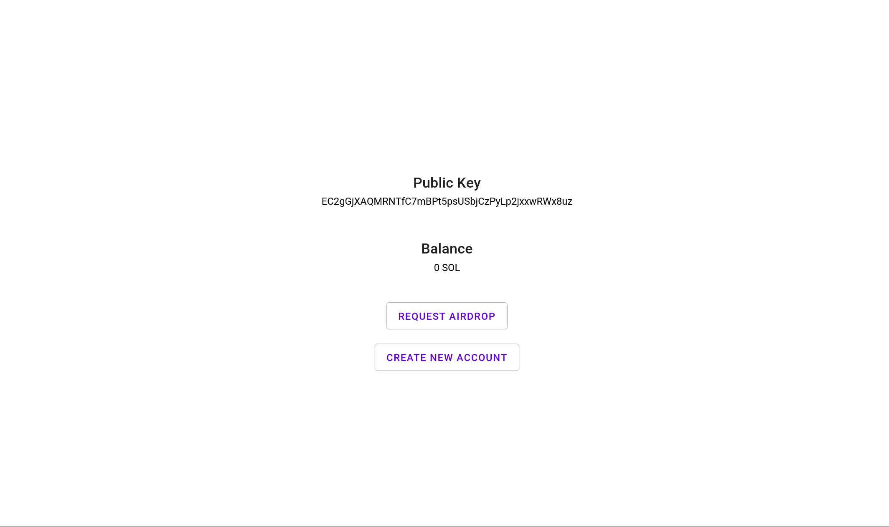
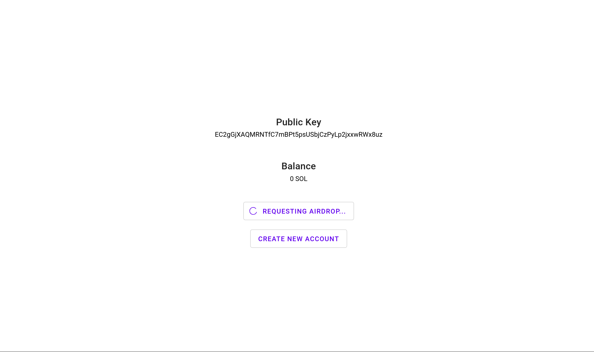
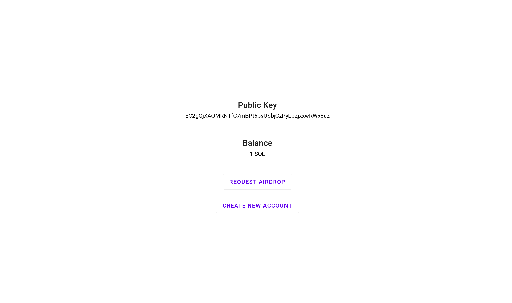

# First Steps with Solana and Web3

In this practical guide you will build a basic Wallet application with React and Web3 that will interact with Solana Network.

This application will do the following operations:

**Connect to the Network**

You will use **Connection** to create a connection with Solana Network. There are three options: *mainnet-beta*, *testnet* and *devnet*.

In this example we will use *devnet* because is the one that acts like a playground for anyone who wants to start to build with Solana and tokens aren't real.

**Generate an Account**

In order to interact with Solana Network you will need to create a Keypair that will contain a Public Key and a Secret Key. Public key will be your address for anyone that want to send you tokens and Secret Key will be used to sign transactions.

**Get the balance of the generated Account**

You can check at anytime the balance of an account if you know its public key.

**Request an Airdrop**

Solana *devnet* allows us to ask for free tokens to be able to do tests while we are building our applications.

These tokens aren't real and you will see them only while you are connected to *devnet*.

## Prerequisites:

In order to follow this guide you will need the following:

- [NodeJS](https://nodejs.org/) installed
- [Expo](https://docs.expo.dev/get-started/installation/) installed
- Some basic React understanding

## Setup the boilerplate

We have prepared a small boilerplate repository to make easier to build this Wallet application.

It contains:

- A basic skeleton with the empty methods that we will implement along the tutorial.
- A layout to show the data that we will get from the Solana Network.
- @solana/web3.js package to communicate with the Solana Network.


File structure:



**App.js**
The main file of the App and where you will put your code.

**app.json**
This file contains information about the project: name, supported platforms, icon, splash images...

**assets**
This folder will contain the images.

**babel.config.js**
This file is used to extend Babel configuration.

**node_modules**
This folder contains all the dependencies and packages of the application.

**package.json**
This file contains a list of dependencies and some scripts to run or build it.

**yarn.lock**
This file will update automatically every time that add new dependencies. It contains a list of the exact versions for every dependency.

First, you will need to clone the Github repository:

```
$ git clone https://github.com/jferrer/solana-web3-quicknode
```

Once cloned, you will need to install dependencies:

```
$ cd expo-solana-wallet
$ yarn install
```

Last, run it:

```
$ expo web
```

At this point you will see the following:

Terminal



Browser



Press **w** in your Terminal or **Run in web browser** in your browser to open the App.



Now that everything is configured and server is running, it's time to start building the Wallet app.

Makes sure that this Terminal is open and Expo is running while you continue following this guide.

## Connect to the Network

Connection to Solana Network is pretty straightforward, we don't need to register to get an account or ask for API keys.

If you open **App.js** you will realize that we already have the imports and the empty functions that you need to implement:

```
import {
Connection,
clusterApiUrl,
...
} from "@solana/web3.js";
```

**Connection** accepts an **endpoint** parameter with the url of the fullnode.

In our example we will use **devnet** that as we mentioned before it is the one intended to act like a playground for anyone who wants to start building in Solana Network and where tokens **are not real**.

Functions are already defined so the only you will need to do is to implement them.

So, look for **createConnection** function in your code and modify it to look like this:

```
const createConnection = () => {
  return new Connection(clusterApiUrl("devnet"));
};
```

Other valid options for the **endpoint** parameter are:

- testnet
- mainnet-beta

Last, we could call this method and print in console to see that is connecting to the Network:

```
...

console.log(createConnection());

return (
...
```

You should see something like this in your browser's console:

```
Object { _commitment: undefined, _confirmTransactionInitialTimeout: undefined, _rpcEndpoint: "https://api.devnet.solana.com", _rpcWsEndpoint: "wss://api.devnet.solana.com/", _rpcClient: {…}, _rpcRequest: createRpcRequest(method, args), _rpcBatchRequest: createRpcBatchRequest(requests), _rpcWebSocket: {…}, _rpcWebSocketConnected: false, _rpcWebSocketHeartbeat: null, … }
```

## Generate an Account

To create an account we will need to generate a Keypair that will contains a Public Key and Secret Key.

For that, we already have the import:

```
import {
...
Keypair
...
} from "@solana/web3.js";
```

Look for the empty **createAccount** function in our code and implement it like this:

```
1 const createAccount = () => {
2   const keypair = Keypair.generate();
3   const initialBalance = 0;
4   setAccount({ keypair: keypair, balance: 0 });
5 };
```

Line 1: Define the function.

Line 2: Define a keypair variable with the result of calling the function to generate a random Keypair.

Line 3: Define an initialBalance variable and set to 0.

Line 4: Set the state variable with 2 keys: keypair and balance.

After save, the application should reload and you will able to create new random accounts everytime that you press the button *Create new account*.



## Get Balance of the Account

To get the balance of an account you will need to look for the **getBalance** function in the code and implement it like this:

```
1 const getBalance = async (publicKey) => {
2   const connection = createConnection();
3
4   const lamports = await connection.getBalance(publicKey).catch((err) => {
5     console.error(`Error: ${err}`);
6   });
7
8   return lamports / LAMPORTS_PER_SOL;
9 };
```

Line 1: Function receives publicKey as parameter.

Line 2: Defines a connection variable with the result of calling createConnection function.

Line 4: Defines a lamports variable with the result of calling the getBalance function of the connection that we defined before.

Line 8: Instead of return the value in lamports (1000000000) we divide it by the amount of lamports in a SOL to return a more friendly value: 1 SOL.

A lamport is the minimal unit in Solana Network: 1 SOL = 1 billion of lamports.


### Request Airdrop

As we said before, in **devnet** tokens are not real. Solana Network let us to request some tokens to be able to do tests while we are building our applications.

Solana Web3  **requestAirdrop** function accepts two parameters:

- **to:** PublicKey of the account
- **lamports:** number of lamports

For that, we will need to implement the empty **requestAirdrop** function in our code like this:

```
1  const requestAirdrop = async (publicKey) => {
2    setRequestAirdropButton({ text: BUTTON_TEXT_LOADING, loading: true });
3    const connection = createConnection();
4
5    const airdropSignature = await connection.requestAirdrop(
6      publicKey,
7      LAMPORTS_PER_SOL
8    );
9
10    const signature = await connection.confirmTransaction(airdropSignature);
11
12    const newBalance = await getBalance(publicKey);
13
14    setAccount({ ...account, balance: newBalance });
15    setRequestAirdropButton({ text: BUTTON_TEXT, loading: false });
16  };
```

Line 1: Function receives publicKey as parameter.

Line 2: Set button to loading state.

Line 3: Defines a connection variable with the result of calling createConnection function.

Line 5-8: Defines an airdropSignature variable with the result of calling requestAirdrop function of the connection that we defined before.

Line 10: Defines a signature variable with the result of calling confirmTransaction function.

Line 12: Defines a newBalance variable with the result of calling our getBalance function.

Line 14: Set state variable to update balance key with newBalance.

Line 15: After update balance we set button to initial state.

Once implemented, presing the **Request Airdrop** button you will see how button text changes to **Requesting Airdrop** because we changed its state in Line 2 while interacts with the Network.



Then, when we receive the confirmation of the Airdrop, Line 10, we ask for the new balance of the account. Last, we update the account state with the new balance and set the button to its original state, Line 15.



## Conclusion

Congratulations on making it to the end! You've taken your first steps to build a basic Wallet Apllication that interacts with Solana Network. You learned how to connect to the network, generate random accounts and request airdrops. Also, you learned how to put everything together working with React.
